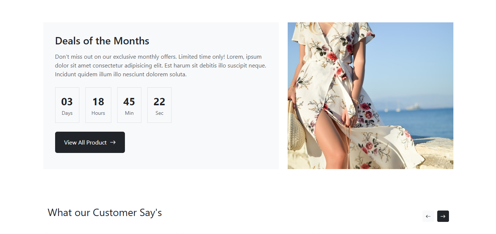

React UI Task
<br />
This repository contains a React-based UI assignment. The project is built using functional components, modern React practices, and a clean folder structure.
<br />
🚀 How to Run the Project
<br />
Follow the steps below to run the project locally:
<br />
<h3>1. Clone the Repository</h3>

```bash
git clone https://github.com/Sohailshaikh5656/react-ui.git
```
<h3>2. Navigate to the Project Folder</h3>

```bash
cd react-ui
```
<h3>3. Install Dependencies</h3>

```bash
npm install
```
<h3>4. Start the Development Server</h3>

```bash
npm start
```
The app will run on http://localhost:3000.
<br />
<h2>📸 Screenshots</h2>
All screenshots of the UI are available inside the /ScreenShot folder.
<div align="center">
<hr />

<hr />

<hr />

</div>
<br />
<h2>📂 Project Structure</h2>
/src — React components & pages
/public — Static assets
/ScreenShot — UI preview images